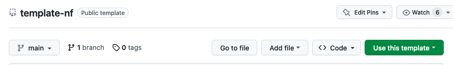
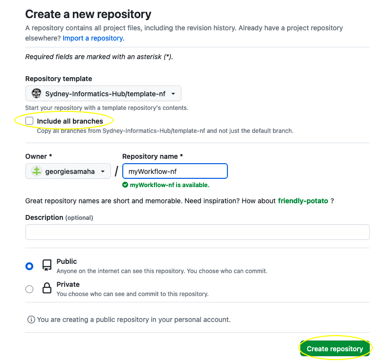
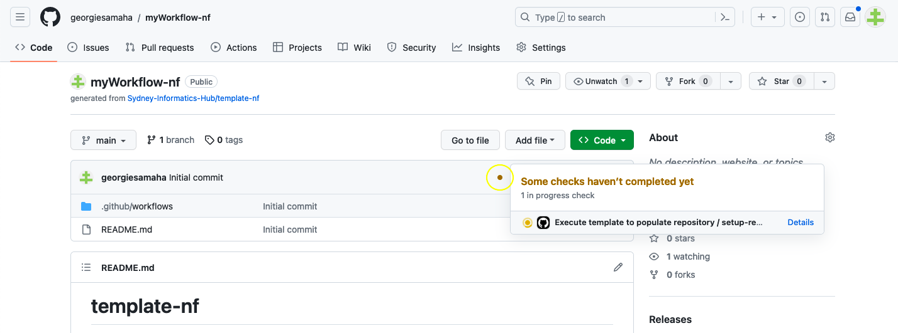
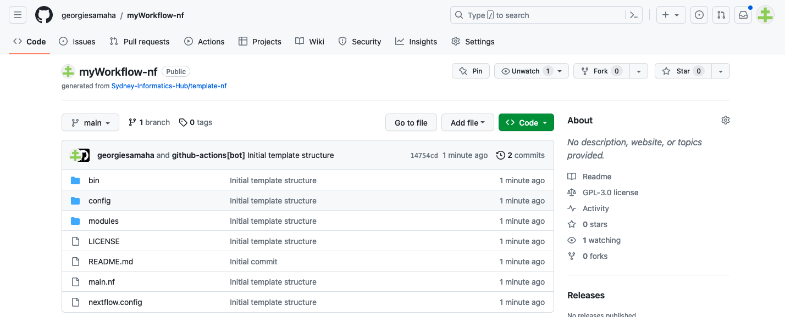

# template-nf

This is a Nextflow workflow template generator. See our guide: https://sydney-informatics-hub.github.io/template-nf-guide/. 

## **Why use this template?** 

[Nextflow](https://www.nextflow.io/) is open source and scalable workflow management software, developed for bioinformatics. It enables the development and execution of integrated, reproducible workflows consisting of multiple processes, various environment management systems, scripting languages, and software packages. 

Given Nextflow's extensive capabilities, there are many ways to structure your workflows. We developed this template to aid beginners in learning how to develop best practice Nextflow workflows. Here, we've prioritised modularity, portability, and flexibility.  

## **Who is this template for?** 

The DSL2 workflow template is suitable for:

* Nextflow newcomers looking for a low barrier to entry, structured starting point, and guidance.
* Custom workflow developers looking for a simple scaffold which can be extended and modified as needed.
* Collaborative teams looking for a standard and consistent workflow code base structure.
* Scalable workflow developers looking for a scalable and reproducible solution for their data analysis and processing needs.

It is not suitable for:

* Those wishing to create and contribute to public nf-core workflows, as it is not nf-core compatible.
* Those creating simple or single-task workflows with only a few tasks and minimal complexity.
* Those with no previous command-line and bash experience.

If you'd like to stickybeak before cloning this repository, you can view the codebase [here](https://github.com/Sydney-Informatics-Hub/Nextflow_DSL2_template/tree/main/%7B%7Bcookiecutter.app_name%7D%7D).

## **How to use the template?** 

### **Quickstart**

1. Click the 'Use this template' button on this page to create a new repository using this template.
2. Clone your new repository to your workspace. 
3. Ensure Nextflow is [installed on your system](https://www.nextflow.io/docs/latest/getstarted.html#installation). 
4. Navigate to the repository directory on your terminal.
5. Run the demo workflow in your terminal and explore outputs [optional]. See the [user guide](https://sydney-informatics-hub.github.io/Nextflow_DSL2_template_guide/) for more information: 

```
nextflow run main.nf --input assets/samplesheet.csv
```

6. Develop your workflow by modifying the `main.nf` and `modules` files. Remove the demo processes in the `modules/` directory and `main.nf` and replace with your own. 

### **User guide**

Once you create a new repository using this template, a GitHub Action workflow will automatically be deployed. This workflow will populate your new repository with the skeleton template directory. To create a new repository: 

1. On this page, select the 'Use this template' button, and select the green 'Create new repository' button: 



2. You'll be taken to a new page where you can configure your new repository. Ensure the 'Include all branches' box is unticked, give your workflow a name, a description (optional), and select whether it should be public or private. Then hit the green 'Create repository' button: 



3. You'll be taken to your new repository page. It will appear like nothing has happened, take note of the brown dot on the top of the code tab/section on this page. This indicates that the GitHub Action is working, if you select it you can observe its progress as it repopulates your repository with the template. It may take a few seconds to run: 



4. Once this brown dot is replaced by a green tick the Action has successfully completed and your repository will be populated with the Nextflow template code base. You may need to refresh your page to observe these changes: 



5. Once your repository has been populated with the template code base, you can open it on your CLI environment and develop your workflow. For example: 

```
git clone https://github.com/georgiesamaha/myWorkflow-nf.git
```

### User guide

Please see the [template guide](https://sydney-informatics-hub.github.io/template-nf-guide/) for instructions on how to use the template code base to build your workflow. 

### Install Nextflow

Depending on the system you're working on there are a few options for installing and running Nextflow including software management tools like bioconda and Singularity. See [here](https://www.nextflow.io/docs/latest/getstarted.html#installation) for installation instructions. Once you have installed Nextflow, you can configure it to run on your system if needed. 

## **Additional resources**

* [Workflow documentation guidelines](https://github.com/AustralianBioCommons/doc_guidelines)

## **Acknowledgements** 

The work presented here was developed by the Sydney Informatics Hub, a Core Research Facility of the University of Sydney and the Australian BioCommons 'Bring Your Own Data' Platforms Project which is enabled by NCRIS via ARDC and Bioplatforms Australia. 
